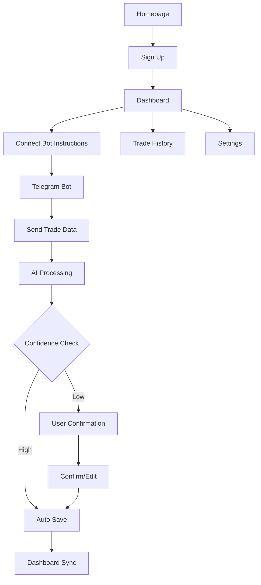

## 1. Product Overview
An AI-first trading journal that eliminates manual logging through Telegram-first interaction. Retail traders send screenshots, voice notes, or text to automatically structure and analyze trades, with everything syncing to a minimalist web dashboard.

Target market: Price-sensitive retail traders in India, SEA, LATAM, EU, and US with $100-500 accounts who hate manual journaling.

## 2. Core Features

### 2.1 User Roles
| Role | Registration Method | Core Permissions |
|------|---------------------|------------------|
| Free User | Email registration | Limited trade logs per month, basic insights |
| Paid User | Email + payment upgrade | Unlimited logs, advanced AI insights, priority support |

### 2.2 Feature Module
The trading journal consists of the following essential pages:
1. **Dashboard**: Today's trades, performance metrics, behavioral patterns
2. **Trade History**: Complete log of all trades with search/filter
3. **Settings**: Profile, billing, Telegram connection, preferences
4. **Connect Bot**: Instructions to link Telegram bot with unique USER_ID

### 2.3 Page Details
| Page Name | Module Name | Feature description |
|-----------|-------------|---------------------|
| Dashboard | Today Summary | Display trades logged today, emotional state indicator, news risk level |
| Dashboard | Performance Metrics | Show win rate, average R, mistake count with simple visualizations |
| Dashboard | Behavioral Patterns | AI-generated insights about trading behavior patterns |
| Trade History | Trade List | Paginated list of all trades with date, instrument, result |
| Trade History | Search/Filter | Search by instrument, date range, result, or emotion tags |
| Settings | Profile | Update email, password, display name |
| Settings | Billing | View subscription status, update payment method, regional pricing |
| Settings | Telegram Connection | Display USER_ID, bot connection status, disconnect option |
| Connect Bot | Instructions | Step-by-step guide to connect Telegram bot with unique USER_ID |

## 3. Core Process

### User Flow
1. User signs up on web with email/password
2. System generates unique USER_ID (TRD-XXXXX format)
3. User connects Telegram bot via `/connect USER_ID` command
4. User sends trade data via Telegram (screenshot, voice, text)
5. AI processes input and creates structured trade entry
6. User confirms/corrects AI interpretation if confidence < threshold
7. Trade syncs to web dashboard automatically
8. Daily/weekly performance summaries sent via Telegram

## 4. User Interface Design

### 4.1 Design Style
- **Primary Colors**: White (#FFFFFF), Light Gray (#F5F5F5), Dark Gray (#2D3748)
- **Accent Colors**: Subtle blue (#4299E1) for CTAs only
- **Typography**: Inter or IBM Plex Sans, 14-16px body text
- **Layout**: Card-based with generous white space
- **Buttons**: Rounded corners, minimal shadows, calm hover states
- **Icons**: Simple line icons, no emojis in UI

### 4.2 Page Design Overview
| Page Name | Module Name | UI Elements |
|-----------|-------------|-------------|
| Dashboard | Today Summary | Clean card layout with trade count, emotion indicator (text only), news risk level |
| Dashboard | Performance Metrics | Simple bar charts for win rate, numeric displays for R and mistakes |
| Dashboard | Behavioral Patterns | Text-based insights in card format, no complex visualizations |
| Trade History | Trade List | Table with instrument, date, direction, result, emotion tags |
| Settings | Profile | Simple form with email, name fields in card layout |
| Settings | Billing | Subscription status card, payment method display |
| Connect Bot | Instructions | Numbered steps with copy USER_ID button |

### 4.3 Responsiveness
Desktop-first design with mobile responsiveness. Telegram is the primary mobile interface, so web dashboard prioritizes desktop experience for analysis.

## 5. Monetization
PPP-based pricing with same features globally:
- India: ₹249-399/month
- SEA/LATAM: $3-6/month  
- EU: €7-10/month
- US: $8-12/month

Free tier: Limited logs per month, basic insights only. No dark patterns or forced annual billing.

## 6. Constraints & Non-Goals

### Constraints
- Boring, proven tools only
- Keep AI costs controllable
- Design for habit formation
- Solo founder friendly initially

### Non-Goals (Do Not Build)
- Social trading features
- Signal generation
- Strategy marketplace
- Complex analytics beyond basic metrics
- Educational content
- Mobile app (Telegram is sufficient)

## 7. Tone
Calm, professional, non-marketing language. Product-builder mindset focused on utility over hype.