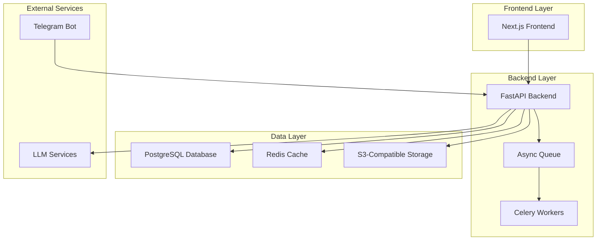
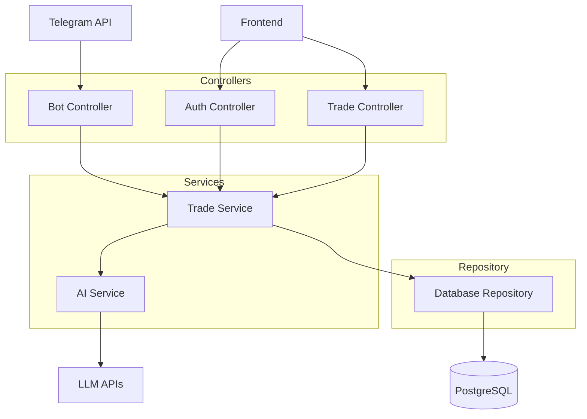
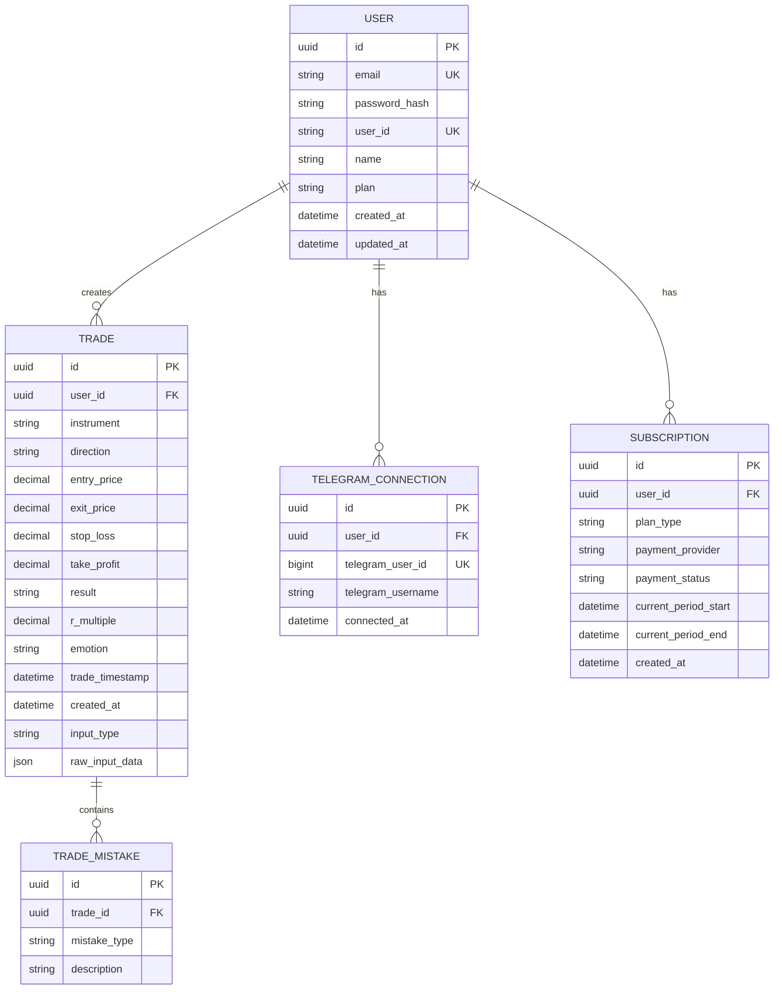

## 1. Architecture Design



## 2. Technology Description
- Frontend: Next.js 14 (App Router) + Tailwind CSS + TypeScript
- Backend: Python + FastAPI + SQLAlchemy
- Database: PostgreSQL
- Cache: Redis
- Storage: S3-compatible (MinIO/AWS S3)
- Async Jobs: Celery + Redis broker
- AI/ML: OpenAI GPT-4V (vision), Whisper (speech-to-text)
- Payments: Stripe (global), Razorpay (India)
- Deployment: Docker + Docker Compose

## 3. Route Definitions
| Route | Purpose |
|-------|---------|
| / | Landing page with pricing and signup |
| /dashboard | Main dashboard with today's trades and performance |
| /trades | Trade history with search and filters |
| /settings | User profile, billing, Telegram connection |
| /connect-bot | Instructions to connect Telegram bot |
| /auth/login | User authentication |
| /auth/register | User registration |

## 4. API Definitions

### 4.1 Authentication APIs
```
POST /api/auth/register
```
Request:
```json
{
  "email": "user@example.com",
  "password": "securepassword",
  "name": "Trader Name"
}
```

```
POST /api/auth/login
```
Request:
```json
{
  "email": "user@example.com",
  "password": "securepassword"
}
```

### 4.2 Trade APIs
```
POST /api/trades/process
```
For Telegram bot to submit trade data:
```json
{
  "user_id": "TRD-8X29K",
  "input_type": "screenshot|voice|text",
  "raw_data": "base64_encoded_image|audio_text|raw_text",
  "metadata": {
    "timestamp": "2024-01-15T10:30:00Z",
    "telegram_message_id": "12345"
  }
}
```

```
GET /api/trades
```
Response:
```json
{
  "trades": [
    {
      "id": "trade_uuid",
      "instrument": "BTCUSDT",
      "direction": "LONG",
      "entry_price": 45000,
      "exit_price": 46000,
      "result": "WIN",
      "r_multiple": 2.0,
      "emotion": "confident",
      "mistakes": [],
      "timestamp": "2024-01-15T10:30:00Z"
    }
  ]
}
```

### 4.3 Telegram Bot APIs
```
POST /api/bot/webhook
```
Webhook endpoint for Telegram updates:
```json
{
  "update_id": 123456789,
  "message": {
    "message_id": 1,
    "from": {"id": 123456789, "username": "trader123"},
    "chat": {"id": 123456789},
    "text": "/connect TRD-8X29K",
    "photo": [],
    "voice": {}
  }
}
```

## 5. Server Architecture Diagram



## 6. Data Model

### 6.1 Database Schema


### 6.2 Data Definition Language

```sql
-- Users table
CREATE TABLE users (
    id UUID PRIMARY KEY DEFAULT gen_random_uuid(),
    email VARCHAR(255) UNIQUE NOT NULL,
    password_hash VARCHAR(255) NOT NULL,
    user_id VARCHAR(10) UNIQUE NOT NULL,
    name VARCHAR(100) NOT NULL,
    plan VARCHAR(20) DEFAULT 'free' CHECK (plan IN ('free', 'basic', 'premium')),
    created_at TIMESTAMP WITH TIME ZONE DEFAULT NOW(),
    updated_at TIMESTAMP WITH TIME ZONE DEFAULT NOW()
);

-- Telegram connections
CREATE TABLE telegram_connections (
    id UUID PRIMARY KEY DEFAULT gen_random_uuid(),
    user_id UUID REFERENCES users(id) ON DELETE CASCADE,
    telegram_user_id BIGINT UNIQUE NOT NULL,
    telegram_username VARCHAR(100),
    connected_at TIMESTAMP WITH TIME ZONE DEFAULT NOW()
);

-- Trades table
CREATE TABLE trades (
    id UUID PRIMARY KEY DEFAULT gen_random_uuid(),
    user_id UUID REFERENCES users(id) ON DELETE CASCADE,
    instrument VARCHAR(50) NOT NULL,
    direction VARCHAR(10) CHECK (direction IN ('LONG', 'SHORT')),
    entry_price DECIMAL(12,4),
    exit_price DECIMAL(12,4),
    stop_loss DECIMAL(12,4),
    take_profit DECIMAL(12,4),
    result VARCHAR(10) CHECK (result IN ('WIN', 'LOSS', 'BREAK_EVEN')),
    r_multiple DECIMAL(8,4),
    emotion VARCHAR(50),
    trade_timestamp TIMESTAMP WITH TIME ZONE,
    created_at TIMESTAMP WITH TIME ZONE DEFAULT NOW(),
    input_type VARCHAR(20) CHECK (input_type IN ('screenshot', 'voice', 'text')),
    raw_input_data JSONB
);

-- Trade mistakes
CREATE TABLE trade_mistakes (
    id UUID PRIMARY KEY DEFAULT gen_random_uuid(),
    trade_id UUID REFERENCES trades(id) ON DELETE CASCADE,
    mistake_type VARCHAR(50) NOT NULL,
    description TEXT
);

-- Subscriptions
CREATE TABLE subscriptions (
    id UUID PRIMARY KEY DEFAULT gen_random_uuid(),
    user_id UUID REFERENCES users(id) ON DELETE CASCADE,
    plan_type VARCHAR(20) NOT NULL,
    payment_provider VARCHAR(20),
    payment_status VARCHAR(20),
    current_period_start TIMESTAMP WITH TIME ZONE,
    current_period_end TIMESTAMP WITH TIME ZONE,
    created_at TIMESTAMP WITH TIME ZONE DEFAULT NOW()
);

-- Indexes
CREATE INDEX idx_users_user_id ON users(user_id);
CREATE INDEX idx_users_email ON users(email);
CREATE INDEX idx_telegram_connections_user_id ON telegram_connections(user_id);
CREATE INDEX idx_telegram_connections_telegram_id ON telegram_connections(telegram_user_id);
CREATE INDEX idx_trades_user_id ON trades(user_id);
CREATE INDEX idx_trades_trade_timestamp ON trades(trade_timestamp);
CREATE INDEX idx_trades_created_at ON trades(created_at DESC);
```

## 7. Telegram Bot Conversation Flow

```
User: /start
Bot: Welcome to TradeJournal AI. Send trades via screenshot, voice, or text.
     Get your USER_ID at: https://app.tradejournal.ai/connect-bot

User: /connect TRD-8X29K
Bot: ✅ Connected successfully. Send your first trade!

User: [Sends screenshot]
Bot: Processing your trade...
Bot: Found: LONG BTCUSDT @ $45,000 → $46,000 (WIN, +2R)
     Confirm? [Edit] [Confirm]

User: [Confirms]
Bot: ✅ Trade logged. View insights at: https://app.tradejournal.ai

User: [Sends voice note]
Bot: Processing voice note...
Bot: Found: SHORT ETHUSDT @ $2,500, stopped out at $2,550 (-1R)
     Confirm? [Edit] [Confirm]

User: /stats
Bot: This week: 8 trades, 62% win rate, +4.2R total
     Biggest mistake: Moving stops too early
```

## 8. AI Prompt Templates

### 8.1 Screenshot Analysis
```
Analyze this trading screenshot and extract trade details.

Extract:
- Instrument/symbol
- Entry and exit prices
- Direction (LONG/SHORT)
- Result (WIN/LOSS/BREAK_EVEN)
- Stop loss and take profit if visible
- P&L or R-multiple if shown

Return JSON format:
{
  "instrument": "BTCUSDT",
  "direction": "LONG",
  "entry_price": 45000,
  "exit_price": 46000,
  "result": "WIN",
  "r_multiple": 2.0,
  "stop_loss": 44000,
  "take_profit": 47000,
  "confidence": 0.85
}

If uncertain about any field, set confidence < 0.8 and explain why.
```

### 8.2 Voice Note Analysis
```
Convert this voice note to structured trade data.

Listen for:
- What was traded
- Entry and exit details
- Why the trade was taken
- How it turned out
- Any emotions or mistakes mentioned

Return JSON format:
{
  "instrument": "extracted symbol",
  "direction": "LONG or SHORT",
  "entry_price": number or null,
  "exit_price": number or null,
  "result": "WIN/LOSS/BREAK_EVEN or null",
  "emotion": "emotion mentioned",
  "mistakes": ["list of mistakes mentioned"],
  "confidence": 0.9
}
```

### 8.3 Text Log Parsing
```
Parse this trade log into structured data.

Look for:
- Symbol/instrument
- Trade direction
- Entry/exit prices
- Position size
- Result or P&L
- Any notes about the trade

Return JSON format:
{
  "instrument": "BTCUSDT",
  "direction": "LONG",
  "entry_price": 45000,
  "exit_price": 46000,
  "position_size": 0.1,
  "result": "WIN",
  "notes": "any additional context"
}
```

## 9. Folder Structure

```
trading-journal/
├── frontend/
│   ├── app/
│   │   ├── (auth)/
│   │   │   ├── login/page.tsx
│   │   │   └── register/page.tsx
│   │   ├── dashboard/page.tsx
│   │   ├── trades/page.tsx
│   │   ├── settings/page.tsx
│   │   └── connect-bot/page.tsx
│   ├── components/
│   │   ├── ui/
│   │   ├── dashboard/
│   │   ├── trades/
│   │   └── settings/
│   ├── lib/
│   │   ├── api.ts
│   │   ├── auth.ts
│   │   └── utils.ts
│   └── types/
├── backend/
│   ├── app/
│   │   ├── api/
│   │   │   ├── auth.py
│   │   │   ├── trades.py
│   │   │   └── users.py
│   │   ├── services/
│   │   │   ├── ai_service.py
│   │   │   ├── trade_service.py
│   │   │   └── subscription_service.py
│   │   ├── models/
│   │   ├── repositories/
│   │   └── bot/
│   │       ├── telegram_bot.py
│   │       └── handlers.py
│   ├── workers/
│   │   └── tasks.py
│   └── core/
├── docker-compose.yml
├── Dockerfile.frontend
├── Dockerfile.backend
└── nginx.conf
```

## 10. Identity & Auth Implementation

1. **User Registration**: Email/password with bcrypt hashing
2. **USER_ID Generation**: Random 5-character alphanumeric (TRD-XXXXX)
3. **Telegram Connection**: One-time `/connect USER_ID` command
4. **Session Management**: JWT tokens with 7-day expiry
5. **Rate Limiting**: 100 API calls per hour per user
6. **Telegram Webhook Security**: Validate Telegram secret token

## 11. Bot Responsibilities

- Accept multimedia inputs (photos, voice, text)
- Process through AI services
- Handle user confirmations/edits
- Send daily/weekly summaries
- Manage user connection state
- Rate limit processing (max 10 trades/hour free tier)

## 12. AI Processing Rules

- Confidence threshold: 0.8 for auto-accept, <0.8 requires confirmation
- Never hallucinate prices or outcomes
- Ask for clarification on ambiguous inputs
- Maintain processing logs for debugging
- Fallback to human review for complex cases
- Cost optimization: Cache similar image analysis results

## 13. Input Type Handling

1. **Screenshots**: Resize to 1024px max, convert to WebP, OCR + vision analysis
2. **Voice Notes**: Convert to MP3, 16kHz sample rate, Whisper transcription
3. **Text**: Direct parsing with regex patterns for common formats
4. **Validation**: All inputs validated for size limits and content safety